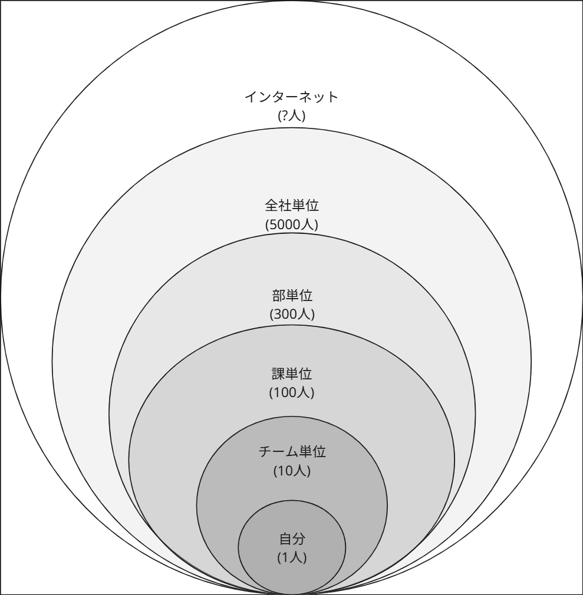

# "アウトプット"のアウトプットをしてみた

いまい

「アウトプットを人前に出す」ことについて、尻込みしてしまいます。  
他の人はどうしているのだろうか？を実際に聞いてみました。  
それを通しての自分の中での気づきをまとめてみました。  

## 自分の状況

まずは自分の中の状況を整理してみました。  

### アウトプットの場と気持ちの変化

当たり前かもしれませんが、見てもらう人数が増えるごとに心の負荷が上がることに気が付きました。

- 自分用（1人規模）：出来る
- チーム向け（10人規模）：出来る
- 課向け（100人規模）：出来る
- 部向け（300人規模）：少し億劫
- 全社向け（5000人規模）：あまりやりたくない
- インターネット向け（??人規模）：やりたくない

→特にインターネット向けは「もし間違っていたら」「もし批判されたら」が怖いなと感じます。

### 自分にとってのアウトプットとは

アウトプットは自分の記録だと思っています。

- 討論をして高めたいわけではなく、自分の中に記録しておきたい。
- 身近で困っている人には共有し役立つのであれば嬉しいが、それ以上を目指してはいない。

## 自分の状況を確認して生まれた疑問

アウトプットを公開している方々と自分は何が異なるのだろうか？

### 疑問1：公開するためのモチベーションが湧いていない

- どのようにモチベーションを持っているのか？
- 誰に届けようとしているのか？

### 疑問2：見てくれる人が誰かわからない/アウトプットに自信がない

- どのような状態でアウトプットを出しているのか？
- どのように知らない人に見せてもいいという気持ちになるのか？
- 「間違いがないと言える」or「間違いがあってもよい」状態が必要なのではないか、どう確かめているのだろうか？

## アウトプットをしている人に聞いてみた

FORTEさん(@FORTEgp05)に聞く機会を設けていただいたので、聞いてみました。

### 疑問1：目的がわからない、モチベーションが湧かないことについて

質問：なぜアウトプットをやっているのか？  

承認欲求、仕事に繋がるとかはあまり考えていない。
楽しいからやっている。

楽しさには2種類ある

1. 自分の中から外に出す工程が楽しい
   - FUNというよりもINTERESTING　知的好奇心
   - 形にすると自分が思っていたことと違うな、ということが必ずある
   - 例えば、「心理的安全性」について、自分は何をやっているか？を書いていったことがある。そのときに、思っていなかったけどやっていたことがあった。着地点が意外だったことがある

2. 他者と接することの楽しさ
   - アウトプットという行為、成果物に関連して誰かと会話できるかもしれない
   - 宝くじが当たったらいいな程度の期待感
   - 他人と会話する自体が楽しいのもあるが、それを通して知的好奇心を満たすことができる

### 疑問2：見てくれる人が誰かわからない/アウトプットに自信がないことについて

質問：自信がない状態でアウトプットすることについて、乗り越えたか？乗り越えていないか？

どちらでもない。今でも何か言われたらやだなはずっと思っている。  
乗り越えていないからやらないか？と言われると関係ないと思っている。  
アウトプットに限らない全般的な話として、わからないことをどうしようと思っても仕方がないと思っている。  
今やるべきことはなんですか？と問われた時に、「アウトプットした方が楽しい」からやっている。

## まとめ：自分の気づき

この結果を通して、自分は以下をしてみようと決めました。  
どなたかの参考になれば幸いです。

- アウトプットへの自信など、ハードルを乗り越えていない状態でもとりあえずアウトプットを作ってみよう/してみようと思った。誰に出すか、どう見せるかは後で考えればいい。
- アウトプットを通して他者と交流をする経験を得てみようと思った。まだ経験をしたことがないので、どんな経験になるかを知ろうと思った。

## 謝辞

こちらのアウトプットをまとめるにあたり、FORTEさんに協力いただきました。協力いただき、ありがとうございました。

#### 本章の執筆者

    
    

        

            <b>いまい</b>
        

    

開発エンジニアをやっています。チームが楽しそうに働いている姿を見るのが好き。そのために何が出来るかを常に考えています。日々出来ることを増やしていきたい。ゴルフも好き。
