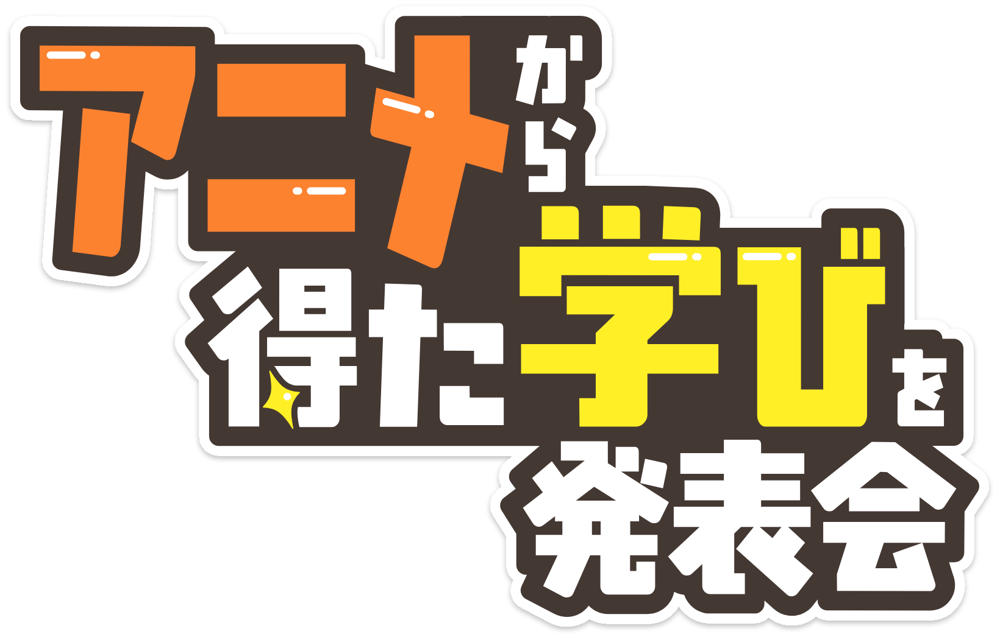

# スポンサー

## 会場スポンサー

**株式会社SHIFT**

{width=80%}

https://www.shiftinc.jp/

SHIFTは、ソフトウェアの品質保証・テストで培ったナレッジを活かし、DXの上流から下流までをカバーするソリューションの開発・提供を進めてきました。国内企業における品質とビジネスアジリティの両立を目指し、300名を超えるアジャイル人材が多様な業界を支援しています。

## コミュニティサポーター/個人スポンサー

**技術書同人誌博覧会**

{width=40%}

https://gishohaku.dev/

技術書同人誌博覧会（技書博）は、技術に関する同人誌の即売会です。ITの他に、理工/数学/デザイン/マネジメントなど幅広い技術を取り扱っています。エンジニアのアウトプットを応援したい＆増やしたいという思いからこのイベントが生まれました。初心者にもベテランにも優しく、ゆったりと交流しながら知識を深め、仲間を作ったり成長できるような場所を目指しています。 

**世迷言ラボ**

{width=40%}

https://kouno-log.pages.dev/

世迷言ラボは代表のこうのが、プログラミングと設計についての技術書を作成しています。
こうのは自らの技術書執筆、地域コミュニティの運営、カンファレンスのコアスタッフなどを通し、
幅広いエンジニアのアウトプットを応援しています。

 

 

 

**エンジニアニメ**

{width=40%}

 https://engineers-anime.connpass.com/

エンジニアが集まってアニメから得た学びについて語り合いながら交流する勉強会です。

皆さんもアニメを見てモチベーションが回復したり、頑張ろうと思えたりした瞬間があると思います。

この会では、ゆるくエンジニアの皆さんが「アニメに影響を受けて考えが変わった話」や「アニメから学ぶモチベーションの維持」などトークも聴きつつ、参加者の皆さんが交流できる場にしたいと思っています。

懇親の時間では技術の話で盛り上がってもいいですし、アニメなどの話題で交流していていただけると嬉しいです！

 

 

 

**うーたん**

{width=40%}

https://x.com/uutan1108

技術書同人誌博覧会のスタッフや若手ふんわり勉強部という若手エンジニア向け勉強会、エンジニアニメというをIT業界に関わる方が集まってアニメから得た学びについて語り合いながら交流する勉強会を主催しています。また、地方カンファレンスのスタッフもしてます。

## サークル

**親方Project**

{width=40%}

https://oyakata.booth.pm/

親方Projectは、本カンファレンスの実行委員長であるおやかたが主宰するサークルです。エンジニアの困ったを解決するテーマを合同誌として発行しています。見積もりやバックアップ、学び、技術同人誌の作り方、などをテーマとした合同誌で、寄稿者は常に募集しています。ぜひご連絡ください。

また、親方Projectが出してきた同人誌を底本として商業出版もしています。

https://www.amazon.co.jp/stores/author/B07FLMHLSY

**モウフカブール**

{width=40%}

https://mofukabur.com

小笠原種高と大澤文孝を中心とした創作集団。写真集や技術書を出している。

 

 

 

**味噌とんトロ定食**

{width=40%}

https://techbookfest.org/organization/33040002

AIやIoTなど、いま流行りの面白そうな技術で「何か」を作ってワイワイするサークルです。